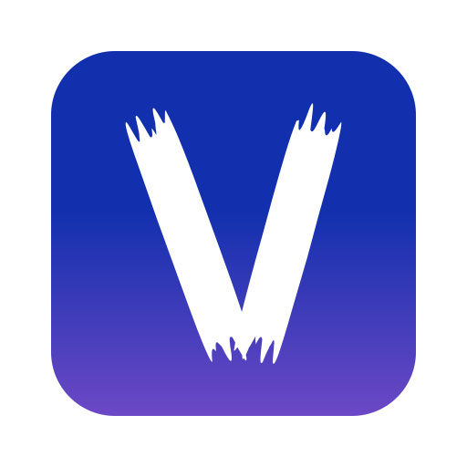

## About Visio
"Visio" berasal dari bahasa Latin yang berarti "penglihatan" atau "imajinasi." Nama ini mencerminkan inti dari layanan penyedia commission gambar: mewujudkan visi dan imajinasi klien menjadi karya seni yang nyata.

Tujuan nya adalah Menyediakan jasa pembuatan logo, Ilustrasi gambar, desain grafis dan juga poster sesuai permintaan, serta menjual produk art yang siap pakai.

## Visi
Kreativitas tanpa batas

## Misi
1. Menciptakan karya seni yang orisinal, inovatif, dan berkualitas tinggi
2. Menyediakan layanan desain grafis dan ilustrasi yang profesional dan efisien
3. Menjadi pilihan utama bagi pelanggan yang mencari layanan desain grafis dan ilustrasi terbaik.

## Value
1. Kualitas dengan harga terjangkau
2. Kemudahan akses
3. Kreativitas tanpa batas

## Typography
Huruf V : Huruf V juga dapat diartikan sebagai dua garis yang berpotongan dan membentuk titik awal. Artinya, ide bisnis kita dapat membuka jalan baru atau mendobrak batasan dalam dunia seni.

Tekstur Kasar: Tekstur yang agak kasar dan tidak sempurna justru memperkuat kesan "membuka jalan" yang menantang dan tidak selalu mudah.

Gradasi Warna: Gradien biru-ungu menunjukkan kedalaman dan kompleksitas visi kreatif. Biru sering dikaitkan dengan kepercayaan, stabilitas dan ketenangan, sedangkan ungu melambangkan kreativitas, misteri dan keagungan. Kombinasi ini menunjukkan keseimbangan antara ketegasan dan keanehan